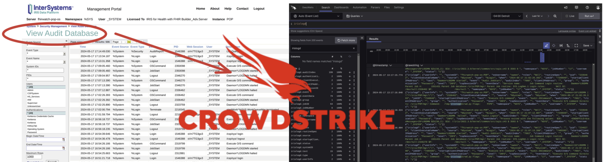
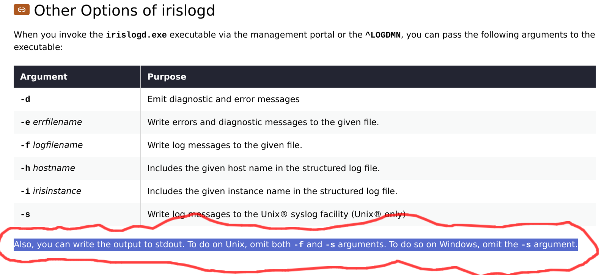
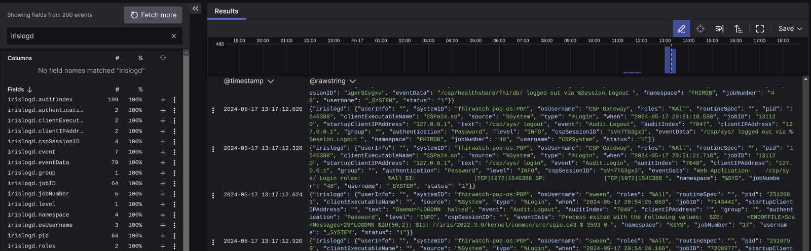
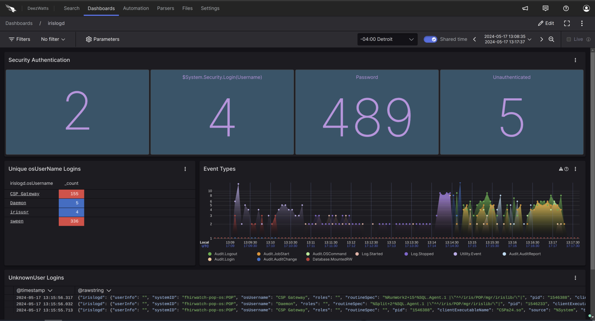

# iris-logscale

InterSystems IRIS SEIM Events to Crowdstrike Logscale



Adding a SIEM integration to InterSystems IRIS for "Audit Database Events" was dead simple with the Community Edition of CrowdStrike's Falcon LogScale, and here's how I got it done.  

### CrowdStrike Community LogScale Setup

Getting Started was ridiculously straight forward and I had the account approved in a couple of days with the following disclaimer:

Falcon LogScale Community is a free service providing you with up to 16 GB/day of data ingest, up to 5 users, and 7 day data retention, if you exceed the limitations, you’ll be asked to upgrade to a paid offering. You can use Falcon LogScale under the limitations as long as you want, provided, that we can modify or terminate the Community program at any time without notice or liability of any kind.

Pretty generous and a good fit for this implementation, with the caveat all good things can come to an end I guess, cut your self an ingestion token in the UI and save it to your favorite hiding place for secrets.

### InterSystems IRIS Structured Logging Setup

Structured Logging in IRIS is documented to the 9's, so this will be a Cliff Note to the end state of configuring ^LOGDMN.  The thing that caught my attention in the docs is probably the most unclear part of the implementation, but the most powerful and fun for sure.



After:
ENABLING the Log Daemon, CONFIGURING the Log Daemon and STARTING Logging your configuration should look like this:

```
%SYS>Do ^LOGDMN
1) Enable logging
2) Disable logging
3) Display configuration
4) Edit configuration
5) Set default configuration
6) Display logging status
7) Start logging
8) Stop logging
9) Restart logging

LOGDMN option? 3
LOGDMN configuration

Minimum level: -1 (DEBUG)
 Pipe command: /tmp/irislogd2crwd.py
       Format: JSON
     Interval: 5
```

### CrowdStrike LogScale Event Processing

It wont take long to get the hang of, but the Search Console is the beginning of all good things with setting up customized observability based on your events.  The search pane with filter criteria displays in the left corner, the available attributes on the left sidebar and the matching events in the results pane in the main view.

LogScale uses The LogScale Query Language (LQL)  to back the widgets, alerts and actions.



I suck at visualizations, so I am sure you could do better than below with a box of crayons, but here is my 4 widgets of glory to put a clown suit on the SIEM events for this post:



If we look under the hood for the "Event Types" widget, the following LQL is only needed behind a time series graph lql:

`timechart(irislogd.event)`

So we did the thing!

We've integrated IRIS with the Enterprise SIEM implementation and the Security Team is "😀 "  

